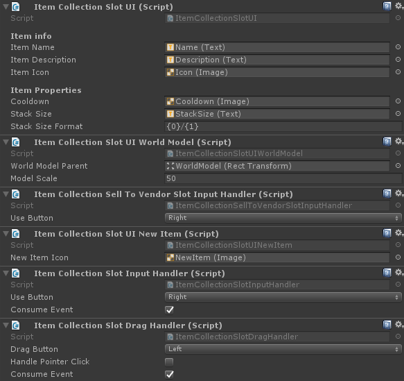

# Collection Slot UI

A Collection slot ui is a representation of a single item in a collection. Slots display the item and all of it's relevant information and handle input, so the end-user can interact with the collection.

## CollectionSlotUIBase<T>

The `CollectionSlotUIBase<T>` is a base class with some simple helper methods. Your class has to inherit from `CollectionSlotUIBase<T>` to be used with built-in collection UI types.

## Invocation order

Input handlers and UI callback receivers will be invoked in the order they're placed on the object. In other words: from top to bottom.



## Event consumption

In case an input module consumes the PointerEventData it will not propagate to the input module below it.

```csharp
eventData.Use(); // Consumes the event and avoids further propagation.
```

An example of event propagation:


## Repaint callback receivers

Any component on the slot object that implements the `ICollectionSlotUICallbackReceiver<T>` interface will receive a callback when the slot changes. Using this you can repaint UI elements without having to fully implement your own slot type.

> Note that the type of <T> has to be the same as the collection's <T>. For example: `Collection<IItemInstance>` requires callback receivers of type `ICollectionSlotUICallbackReceiver<IItemInstance>`

For example: The `ItemCollectionSlotUIWorldModel` component shows a 3D model of the item inside the UI. This is done through a callback, making it an optional addition to your slot UI components.

```csharp
using Devdog.General;
using Devdog.InventoryPlus.Items;
using Devdog.InventoryPlus.UI;
using UnityEngine;
using UnityEngine.Assertions;
using UnityEngine.EventSystems;

public sealed class MyCollectionSlotUICallbackReceiver : MonoBehaviour, ICollectionSlotUICallbackReceiver<IItemInstance>
{
	[Required]
	[SerializeField]
	private Image _additionalImage;
	
	public void Repaint(IItemInstance item, int amount)
	{
		// Display some image when this slot is not empty.
		_additionalImage.gameObject.SetActive(item != null);
	}
}
```

## Input handlers

Event handlers handle the input of a single slot.

```csharp
using Devdog.General;
using Devdog.InventoryPlus.Items;
using Devdog.InventoryPlus.UI;
using UnityEngine;
using UnityEngine.Assertions;
using UnityEngine.EventSystems;

public sealed class MyCollectionSlotInputHandler : MonoBehaviour, ICollectionSlotInputHandler<IItemInstance>, IPointerClickHandler
{
	public PointerEventData.InputButton useButton = PointerEventData.InputButton.Right;
	public bool consumeEvent = true;
	
	private CollectionSlotUIBase<IItemInstance> _slot;
	private void Awake()
	{
		_slot = GetComponent<CollectionSlotUIBase<IItemInstance>>();
		Assert.IsNotNull(_slot, "No SlotUI found on input handler!");
	}
	
	public void OnPointerClick(PointerEventData eventData)
	{
		if (eventData.button == useButton)
		{
			// Do something with the slot here, such as use the item inside it.
			_slot.current?.Use(PlayerManager.instance.currentPlayer, new ItemContext());
			
			if (consumeEvent)
			{
				eventData.Use();
			}
		}
	}
}
```

## Drag handlers

An example of a simple drag handler for a custom collection type.

```csharp
using Devdog.InventoryPlus.Items;
using Devdog.InventoryPlus.UI;

public sealed class ItemCollectionSlotDragHandler : CollectionSlotDragHandlerBase<IItemInstance>
{
	// That's it. 
	// Unity doesn't support generic components so we have to create a new class.
}
```

### CollectionSlotDragHandlerBase<T>

The `CollectionSlotDragHandlerBase<T>` is a simple implementation of a drag handler that can be re-used for different types of collections. You're not required to use this class.