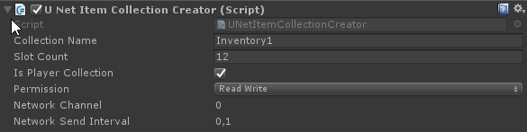

# Collection Creators

When repainting a UI, or binding the collection in any way the `Collection Name` is used. For example: When connecting a [CollectionUI](CollectionUI.md) component make sure the `Collection Name` fields match up.

## Standard single player

The `Collection Name` is the general identifier of a collection while the GUID is used to uniquely identify a collection. For example: You may have 2 collections named `Loot`, while each loot collection has it's own unique GUID.

!!! note
	Hit the "Gen" button to generate a new unique GUID for the collection.

## UNet

The `Collection Name` is the (client-side) identifier of a collection. When repainting a UI, or binding the collection somehow the `Collection Name`'s have to be used. For example: When connecting a [CollectionUI](CollectionUI.md) component make sure the names match up.

!!! note
	The `UNetCollectionCreator` will auto. generate a GUID that will be used internally.

!!! note
	When checking `Is Player Collection` the collection will be bound to the player and given `Permission`. This auto. propagates over the network to the client.

