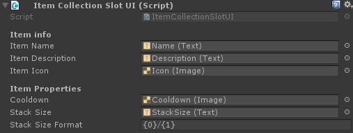
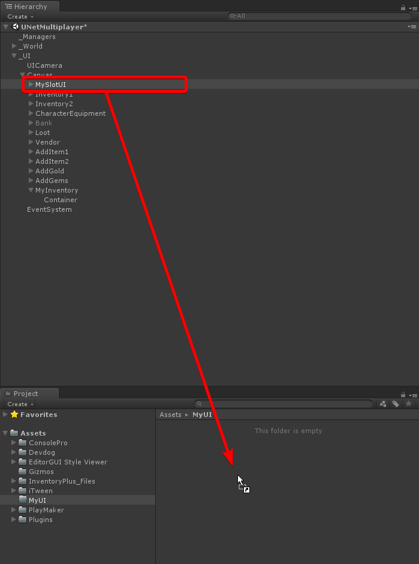

# Collection Slot UI

Inside a collection UI slots are used. A slot represents a single item in the collection and displays all information about the item.

!!! note
	You can create any design you like, so long the UI references are assigned in the ItemCollectionSlotUI component.



## Input handlers

Input handlers, as the name describes, handle the input of a collection slot. These are modular small components that each handle a single task. This can be dragging, use to click, dropping, etc.

A collection slot requires an input handler so that the user can interact with it. If you want to create a read-only collection the user can not interact with, removing all the input handlers is an easy and simple way to do this.

!!! note
	ItemCollection input handlers only work on item collections. For example: A vendor collection contains products and therefore needs input handlers that implements `ICollectionSlotInputHandler<IVendorProduct<IItemInstance>>`.


- Use Button: The mouse button the user has to press to use the item.
- Consume Event: When true the "click" event will not propagate to other components (components below this one will not fire).

Drag handler


- Drag Button: The button the user has to press to drag this item.
- Handle Pointer Click: Start a drag action when the user clicks the slot once.
- Consume Event: When true the "drag" event will not propagate to other components (components below this one will not fire).

## Callbacks

Any component on the slot object that implements the `ICollectionSlotUICallbackReceiver<IItemInstance>` interface will receive a callback when the slot changes. Using this you can repaint UI elements without having to fully implement your own slot type.

For example: The `ItemCollectionSlotUIWorldModel` component shows a 3D model of the item inside the UI. This is done through a callback, making it an optional addition to your slot UI components.


## Walk through

1. Create a new empty object in your canvas.
2. Attach the `ItemCollectionSlotUI` component.


3. Create and assign UI elements for repainting.

I've put the Image component (icon) on the "MySlotUI" object itself. This way the icon will be the Raycast target and all child items will have the raycast target flag unchecked. For performance reasons you want to have as little raycast targets as possible.


4. Add input handlers


5. Drag the UI element to your project folder to create a prefab out of it.



6. Assign the new UI prefab to your `ItemCollectionUI` component to render your item collection with the new UI prefab.


## CollectionSlotUIBase<T>

The `CollectionSlotUIBase<T>` is a base class with some simple helper methods. Your class has to inherit from `CollectionSlotUIBase<T>` to be used with built-in collection UI types.

## Invocation order

Input handlers and UI callback receivers will be invoked in the order they're placed on the object. In other words: from top to bottom.


## Event consumption

In case an input module consumes the PointerEventData it will not propagate to the input module below it.

```csharp
eventData.Use(); // Consumes the event and avoids further propagation.
```

An example of event propagation:


## Repaint callback receivers

Any component on the slot object that implements the `ICollectionSlotUICallbackReceiver<T>` interface will receive a callback when the slot changes. Using this you can repaint UI elements without having to fully implement your own slot type.

!!! note
	The type of <T> has to be the same as the collection's <T>. For example: `Collection<IItemInstance>` requires callback receivers of type `ICollectionSlotUICallbackReceiver<IItemInstance>`

For example: The `ItemCollectionSlotUIWorldModel` component shows a 3D model of the item inside the UI. This is done through a callback, making it an optional addition to your slot UI components.

```csharp
using Devdog.General;
using Devdog.InventoryPlus.Items;
using Devdog.InventoryPlus.UI;
using UnityEngine;
using UnityEngine.Assertions;
using UnityEngine.EventSystems;

public sealed class MyCollectionSlotUICallbackReceiver : MonoBehaviour, ICollectionSlotUICallbackReceiver<IItemInstance>
{
	[Required]
	[SerializeField]
	private Image _additionalImage;
	
	public void Repaint(IItemInstance item, int amount)
	{
		// Display some image when this slot is not empty.
		_additionalImage.gameObject.SetActive(item != null);
	}
}
```

## Input handlers

Event handlers handle the input of a single slot.

```csharp
using Devdog.General;
using Devdog.InventoryPlus.Items;
using Devdog.InventoryPlus.UI;
using UnityEngine;
using UnityEngine.Assertions;
using UnityEngine.EventSystems;

public sealed class MyCollectionSlotInputHandler : MonoBehaviour, ICollectionSlotInputHandler<IItemInstance>, IPointerClickHandler
{
	public PointerEventData.InputButton useButton = PointerEventData.InputButton.Right;
	public bool consumeEvent = true;
	
	private CollectionSlotUIBase<IItemInstance> _slot;
	private void Awake()
	{
		_slot = GetComponent<CollectionSlotUIBase<IItemInstance>>();
		Assert.IsNotNull(_slot, "No SlotUI found on input handler!");
	}
	
	public void OnPointerClick(PointerEventData eventData)
	{
		if (eventData.button == useButton)
		{
			// Do something with the slot here, such as use the item inside it.
			_slot.current?.Use(PlayerManager.instance.currentPlayer, new ItemContext());
			
			if (consumeEvent)
			{
				eventData.Use();
			}
		}
	}
}
```

## Drag handlers

An example of a simple drag handler for a custom collection type.

```csharp
using Devdog.InventoryPlus.Items;
using Devdog.InventoryPlus.UI;

public sealed class ItemCollectionSlotDragHandler : CollectionSlotDragHandlerBase<IItemInstance>
{
	// That's it. 
	// Unity doesn't support generic components so we have to create a new class.
}
```

### CollectionSlotDragHandlerBase<T>

The `CollectionSlotDragHandlerBase<T>` is a simple implementation of a drag handler that can be re-used for different types of collections. You're not required to use this class.