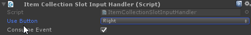

# Collection Slot UI

Inside a collection UI slots are used. A slot represents a single item in the collection and displays all information about the item.

## Input handlers

Input handlers, as the name describes, handle the input of a collection slot. These are modular small components that each handle a single task. This can be dragging, use to click, dropping, etc.

A collection slot requires an input handler so that the user can interact with it. If you want to create a read-only collection the user can not interact with, removing all the input handlers is an easy and simple way to do this.

> Note that ItemCollection input handlers only work on item collections. For example: A vendor collection contains products and therefore needs input handlers that implements `ICollectionSlotInputHandler<IVendorProduct<IItemInstance>>`.

- Use Button: The mouse button the user has to press to use the item.
- Consume Event: When true the "click" event will not propagate to other components (components below this one will not fire).

Drag handler

- Drag Button: The button the user has to press to drag this item.
- Handle Pointer Click: Start a drag action when the user clicks the slot once.
- Consume Event: When true the "drag" event will not propagate to other components (components below this one will not fire).

## Callbacks

Any component on the slot object that implements the `ICollectionSlotUICallbackReceiver<IItemInstance>` interface will receive a callback when the slot changes. Using this you can repaint UI elements without having to fully implement your own slot type.

For example: The `ItemCollectionSlotUIWorldModel` component shows a 3D model of the item inside the UI. This is done through a callback, making it an optional addition to your slot UI components.

## Walk through

