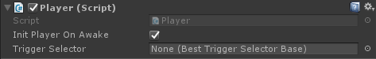

# Player

`Player`'s are controlled by an end-user, while `Character`'s are any type of character in your game (monsters, npcs, your player, etc).

> A `Player` is a `Character`. You don't need to add the `Character` component to your player object, just the `Player` component.

## Character

A character component is only required on an object if you want that object to interact with the inventory system. For example: if you want a NPC to buy items from a vendor this NPC requires a character component. If your NPC does not interact with the inventory system in any way the character component is not required.

