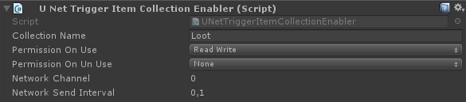

# Collection Enablers

This is only required for networked games.

A collection enabler allows you to enable / disable a collection based on a specific event or action. For example: The player walks up to a bank NPC and talks to it. At this point the player has to receive at least READ access on the bank collection to view it.

You can also manually specify permissions on collections and objects. See [Permission system](../UNet/UNet.md).