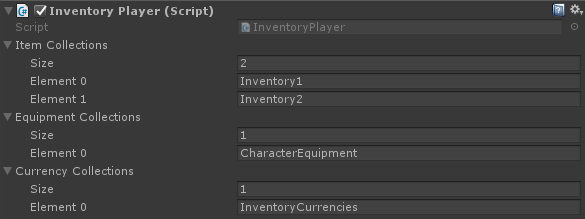

# Player

`Player`'s are controlled by an end-user, while `Character`'s are any type of character in your game (monster, npc, etc).

!!! note
	A `Player` is a `Character`. You don't need to add the `Character` component to your player object, just the `Player` component.

## Inventory Player

In addition to the `Player` component an `*InventoryPlayer` component is also required. This defines which collections the player owns. See [Collection Creators](../Collections/CollectionCreators.md) on how to create collections.

## UNet Inventory Player

When using UNet make sure to use the `UNetInventoryPlayer` component instead of the standard `InventoryPlayer` component.

## UNetInitPlayer

The `UNetInitPlayer` is a simple component that registers your player locally whenever the server gives permission (OnStartAuthority). Attach this component to your player and disable `Init Player On Start` on your default Player component.

## Character

A character component is only required on an object if you want that object to interact with the inventory system. For example: if you want a NPC to buy items from a vendor this NPC requires a character component. If your NPC does not interact with the inventory system in any way the character component is not required.

