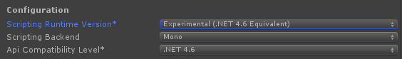

# Getting started with Rucksack

Start by importing Rucksack and changing Unity's .Net version to 4.6.

Alright, now we're ready to get going!

## Videos

<iframe width="560" height="315" src="https://www.youtube.com/embed/fQXOAHr50ag" frameborder="0" allow="autoplay; encrypted-media" allowfullscreen></iframe>

!!! warning
	There is a mistake in the video tutorial. A `UNetItemFactory` component needs to be added to the _Managers or _UNet object. This is not shown in the video, but is required. 

## Creating a player

See [Player](General/Player.md) for more info.

## Adding a player collection

See [Collection Creators](Collections/CollectionCreators.md) for more info.

## Adding a world collection

Adding a collection to a world object is the same as adding it to the player. Simply attach the creator component to an object and make sure `Is Player Collection` is unchecked.

## Creating a basic UI

See [Collection UI](Collections/CollectionUI.md) for more info.
